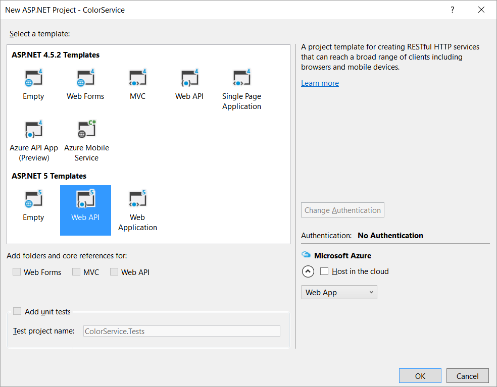

:compat-mode:
= Lab 5 - Deploy a .NET Application

In this lab we'll deploy an ASP.NET v5 application to Cloud Foundry, and run it inside of a linux container using the .NET CoreCLR. 

NOTE: ASP.NET 5 is not yet GA, and so many of you may not have it installed already.  There are instructions included below on installing ASP.NET 5, or you can choose to use the completed materials available at `$COURSE_HOME/session_03/dotnet/lab_05/complete`.

== (Optional) Create a new ASP.NET v5 application

. If you wish to perform the coding portion of this lab, start by making sure you have a recent version of ASP.NET v5 installed.  Instructions can be found here: http://docs.asp.net/en/latest/getting-started/installing-on-windows.html

. Once the prerequisites are installed, Open Visual Studio and go to `File->New->Project`

. Choose the option to create a New ASP.NET Web Application, and name it `ColorService`
+
image::../../../Common/images/net5_1.png[]

. Under _ASP.NET 5 Templates_ choose to create a new _Web API_ and click `OK`
+

. There appears to be a bug in the Visual Studio template that causes invalid JSON to be produced within package.json.  Fix this by opening `package.json` and removing the comma at the end of this line:
+
[source,json]
----
"web": "Microsoft.AspNet.Server.Kestrel",
----

. Create a new controller in the Controllers folder called `ColorsController.cs` with the following code:
+
[source,c#]
----
using System;
using System.Collections.Generic;
using System.Linq;
using System.Threading.Tasks;
using Microsoft.AspNet.Mvc;

namespace ColorService.Controllers
{
    [Route("api/[controller]")]
    public class ColorsController : Controller
    {
        // GET: api/colors
        [HttpGet]
        public IEnumerable<string> Get()
        {
            return new string[] { "blue" };
        }
    }
}
----

. Delete the template's default ValuesController.cs

. Edit launchSettings.json, found in the Properties section of ColorService, and change `launchUrl` to `"api/colors"`

. Save all of your changes, and run your application locally by pressing the play button.  This will launch your browser at localhost:[port]/api/colors. You should get the following response from your new REST method:
+
[source,bash]
----
["blue"]
----

== Push a .NET application to Cloud Foundry

. If you completed the steps above, continue using your application for these next steps.  Otherwise, use the completed version of the application available here: `$COURSE_HOME/session_03/dotnet/lab_05/complete`

. Stop the application, and navigate a command line window to the root of the .NET project directory (the folder in which files like `project.json` and `appsettings.json` appear).  It is important you are in the correct folder when you push an application from CloudFoundry.

. In this directory, create a new `manifest.yml` file, and set up your deployment metadata using these values.
+
[source,bash]
----
---
applications:
- name: colorservice
  host: colors-${random-word}
  path: .
  buildpack: https://github.com/cloudfoundry-community/asp.net5-buildpack.git
----

. Push the application to Cloud Foundry.
+
[source,bash]
----
cf push
----

. Once the command completes, you can test your application running within Cloud Foundry.  Get the application route, either by using the Apps Manager or executing the `cf apps` command.  Open that route in the browser, and append the API endpoing `api/colors` to the end of the URL.  You should again see your response, 
+
[source,bash]
----
["blue"]
----

== Clean up

. We will use this application again, in a later lab, so don't delete your Project locally yet.  However, you can delete the running application instance for now.  We will push it again later.
+
[source,bash]
----
cf d colorservice
----

