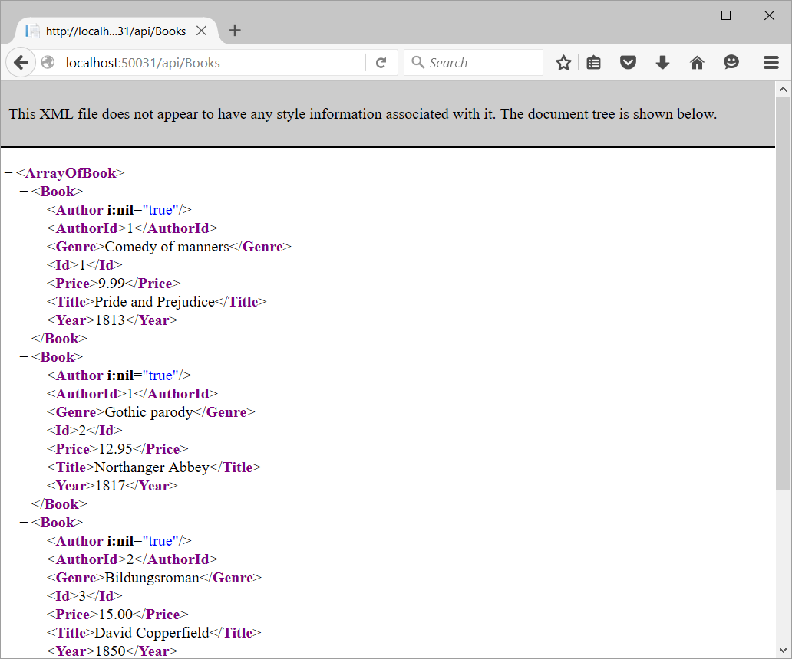

:compat-mode:
= Lab 5 - Deploy a .NET Application

In this lab we'll take an existing .NET 4.5 application that uses a SQL Server Express LocalDB configuration and enable it to run in Cloud Foundry while accessing a managed MySQL instance.

NOTE: The completed code for this lab can be found at `$COURSE_HOME/session_03/dotnet/lab_06/complete/BookService`.

== Initializing the Application

. Navigate to the lab directory at `$COURSE_HOME/session_03/lab_06/initial/BookService` and then open `BookService.sln` using Visual Studio.

. Verify you can run the application locally by pressing the play button to launch the application.  This will open a browser, pointed to `localhost:[port]`.  From here, test the `api/Books` endpoint:
+

. Now we'll use NuGet to configure the necessary MySQL packages for this application.  Open the Package Manager Console by going to `Tools -> NuGet Package Manager -> Package Manager Console`
+
Install the `MySql.Data`
+
[source,bash]
----
PM> Install-Package MySql.Data
Attempting to gather dependencies information for package 'MySql.Data.6.9.8' with respect to project 'BookService', targeting '.NETFramework,Version=v4.5'
...
----
+
And then, install the `MySql.Data.Entity` package
+
[source,bash]
----
PM> Install-Package 'MySql.Data.Entity'
Attempting to gather dependencies information for package 'MySql.Data.Entity.6.9.8' with respect to project 'BookService', targeting '.NETFramework,Version=v4.5'
....
----
== Reading the Environment
. When services, like MySql are bound to applications in Cloud Foundry, the platform will inject information about the services into the VCAP_SERVICES environment variable.  The Java Spring Framework has built in capabilities to read these variables and do Dependency Injection across an application.  This capability is currently being developed for .NET applications as well.  For now, we have to write some code to parse these variables, and then use that information to appropriately set up the Entity Framework.
+
Start by adding a new Folder called CloudServices to the BookService project.  Create a new file called VcapServices.cs, and paste the following code into it:
+
[source,c#]
----
using Newtonsoft.Json.Linq;
using NLog;
using System;
using System.Collections.Generic;
using System.Linq;
using System.Web;

namespace BookService.CloudServices
{
    public class VcapServices
    {
        private static readonly Logger Nlog = LogManager.GetCurrentClassLogger();
        private static VcapServices instance;
        private string rawEnv = null;
        private JObject parsedEnv = null;
        private Dictionary<string, JToken> serviceDictionary = null;
        
        public static VcapServices Instance()
        {
            if (instance == null)
            {
                instance = new VcapServices();
                Nlog.Trace("Checking for VCAP_SERVICES");
                instance.rawEnv = Environment.GetEnvironmentVariable("VCAP_SERVICES");
                if (instance.rawEnv != null)
                {
                    Nlog.Trace("Parsing VCAP_SERVICES");
                    instance.parsedEnv = JObject.Parse(instance.rawEnv);

                    Nlog.Trace("Getting services from parsed VCAP_SERVICES");
                    instance.serviceDictionary =
                        instance.parsedEnv.Children().Children().Children().ToDictionary(val => val["name"].ToString(), val => val);
                }
            }
            return instance;
        }

        public bool IsCF
        {
            get
            {
                return rawEnv != null;
            }
        }

        public JToken GetService(string name)
        {
            return serviceDictionary[name];
        }
    }
}
----
+
This class imply reads the VCAP_SERVICES environment variables, and parses it into an in-memory dictionary for use elsewhere within the application. 

. Now add another file to CloudServices called `EFConfigurer.cs`
+
[source,c#]
----
using MySql.Data.Entity;
using Newtonsoft.Json.Linq;
using System.Collections.Generic;
using System.Data.Entity;
using System.Web;

[assembly: PreApplicationStartMethod(typeof(BookService.CloudServices.EFConfigurer), "Configure")]
namespace BookService.CloudServices
{
    public class EFConfigurer
    {
        public static void Configure()
        {
            VcapServices vcapServices = VcapServices.Instance();
            if(vcapServices.IsCF)
            {
                JToken service = vcapServices.GetService("BookServiceContext");

                IEnumerator<JToken> tags = service["tags"].Values().GetEnumerator();
                while(tags.MoveNext())
                {
                    if("mysql".Equals(tags.Current.ToString()))
                    {
                        DbConfiguration.SetConfiguration(new MySqlEFConfiguration());
                    }
                }
            }
        }
    }
}
----
+
This is a bootstrapping class - when we detect that a MySql database has been bound to our application, we will reconfigure the EntityFramework to use MySql.  

. Now add another class to CloudServices called `CFConnectionStringBinder.cs`
+
[source,c#]
----
using BookService.Models;
using Newtonsoft.Json.Linq;
using NLog;
using System;
using System.Collections.Generic;
using System.Configuration;
using System.Linq;

namespace BookService.CloudServices
{
    public class CFConnectionStringBinder
    {
        private static readonly Logger Nlog = LogManager.GetCurrentClassLogger();

        private static Dictionary<string, string> conStringCache = new Dictionary<string, string>();

        public static string Bind(string connectionStringName)
        {
            Nlog.Trace(String.Format("Checking for {0} in cached strings", connectionStringName));
            string conStr = null;
            if (conStringCache.ContainsKey(connectionStringName)) conStr = conStringCache[connectionStringName];
            else
            {
                conStr = LookupString(connectionStringName);
                conStringCache[connectionStringName] = conStr;
            }

            return conStr;
        }

        private static string LookupString(string connectionStringName)
        {
            if( ConfigurationManager.ConnectionStrings[connectionStringName] == null)
            {
                Nlog.Error("No connection string found matching given connection string name, returning null...");
                return null;
            }

            VcapServices vcap = VcapServices.Instance();

            if (!vcap.IsCF)
            {
                Nlog.Info("VCAP_SERVICES not set - returning connection string from app config...");
                return ConfigurationManager.ConnectionStrings[connectionStringName].ConnectionString;
            }

            Nlog.Trace(String.Format("Checking for {0} in VCAP_SERVICES", connectionStringName));
            JToken service = vcap.GetService(connectionStringName);

            if (service != null)
            {
                Nlog.Trace(String.Format("Found service named {0} in VCAP_SERVICES.  Reconfiguring for bound services.", connectionStringName));
                JToken creds = service["credentials"];
                string conString = "";
                if(creds["connectionString"] != null)
                {
                    conString = creds["connectionString"].ToString();
                }
                else
                {
                    conString = String.Format("server={0};port={1};database={2};uid={3};password={4};",
                        creds["hostname"],
                        creds["port"],
                        creds["name"],
                        creds["username"],
                        creds["password"]);
                }
                Nlog.Debug(conString);
                return conString;
            }
            else
            {
                Nlog.Info("Couldn't find bound service - returning connection string from app config...");
                return ConfigurationManager.ConnectionStrings[connectionStringName].ConnectionString;
            }
        }
    }
}
----
+
This class decides which connection string to return based on whether a MySql service is bound to the application.  If so, it reads the connection information for the MySql service and constructs an appropriate connection string.

. Finally, inside of `Models\BookServiceContext.cs`, we pass our new connection string binder to the `DbContext` superclass:
+
[source,c#]
----
using BookService.CloudServices;
using BookService.Migrations;
using System.Data.Entity;

namespace BookService.Models
{
    public class BookServiceContext : DbContext
    {
        // You can add custom code to this file. Changes will not be overwritten.
        // 
        // If you want Entity Framework to drop and regenerate your database
        // automatically whenever you change your model schema, please use data migrations.
        // For more information refer to the documentation:
        // http://msdn.microsoft.com/en-us/data/jj591621.aspx
    
        public BookServiceContext() : base(CFConnectionStringBinder.Bind("BookServiceContext"))   // <------ UPDATE THIS LINE
        {
            Database.SetInitializer(new MigrateDatabaseToLatestVersion<BookServiceContext, Configuration>());
        }

        public System.Data.Entity.DbSet<BookService.Models.Author> Authors { get; set; }

        public System.Data.Entity.DbSet<BookService.Models.Book> Books { get; set; }
    
    }
}
----

. Now Publish the application.  Right-click on the _BookService_ project in the Solution Explorer, and choose `Publish...`.  Use the CloudFoundry profile with its defaults to publish the Solution to `C:\temp\bookservice`

. From a command prompt, navigate to the new publish directory:
+
[source,bash]
----
cd C:\temp\bookservice
----

. We need a MySql service for our application to bind to, and the code we've written expects it to be called `BookServiceContext`, so let's create that:
+
[source,bash]
----
cf create-service p-mysql 100mb-dev BookServiceContext
Creating service instance BookServiceContext in org student40-org / space development as student40...
OK

----

. Now, push the application
+
[source,bash]
----
cf push

Using manifest file C:\temp\BookService\manifest.yml

Using stack windows2012R2...
OK
Creating app bookservice in org student40-org / space development as student40...
OK

Using route bookservice.pcf5.cloud.fe.pivotal.io
Binding bookservice.pcf5.cloud.fe.pivotal.io to bookservice...
OK

Uploading bookservice...
Done uploading
OK
Binding service BookServiceContext to app bookservice in org student1-org / space development as student1...
OK

Starting app bookservice in org student1-org / space development as student1...
Creating container
Successfully created container
Downloading app package...
Downloaded app package (3.9M)
Staging...
Exit status 0
Staging complete
Uploading droplet, build artifacts cache...
Uploading droplet...
Uploading build artifacts cache...
Uploaded build artifacts cache (37B)
Uploaded droplet (3.9M)
Uploading complete

0 of 1 instances running, 1 starting
0 of 1 instances running, 1 starting
0 of 1 instances running, 1 starting
0 of 1 instances running, 1 starting
0 of 1 instances running, 1 starting
0 of 1 instances running, 1 starting
0 of 1 instances running, 1 starting
1 of 1 instances running

App started

OK

App bookservice was started using this command `..\tmp\lifecycle\WebAppServer.exe`

Showing health and status for app bookservice in org student1-org / space development as student1...
OK

requested state: started
instances: 1/1
usage: 1G x 1 instances
urls: bookservice12.pcf14.cloud.fe.pivotal.io
last uploaded: Mon Mar 7 17:33:29 UTC 2016
stack: windows2012R2
buildpack: https://github.com/ryandotsmith/null-buildpack.git

     state     since                    cpu    memory       disk          details
#0   running   2016-03-07 12:34:43 PM   0.0%   311M of 1G   23.3M of 1G
----

. Now test the application by gettings its route ( `cf apps` ), opening it in a browser, and going to the `api/Books` endpoint.  You'll see the same data being returned as you did locally, except that the data is being provided by MySql now.

== Clean Up

Issue the following commands to delete the cities application and its database.

. Delete the `bookservice` application:
+
----
$ cf d bookservice

Really delete the app bookservice?> y
Deleting app bookservice in org oreilly-class / space instructor as mstine@pivotal.io...
'OK
----

. Delete the `BookServiceContext` service:
+
----
$ cf ds BookServiceContext

Really delete the service BookServiceContext?> y
Deleting service BookServiceContext in org oreilly-class / space instructor as mstine@pivotal.io...
OK
----
