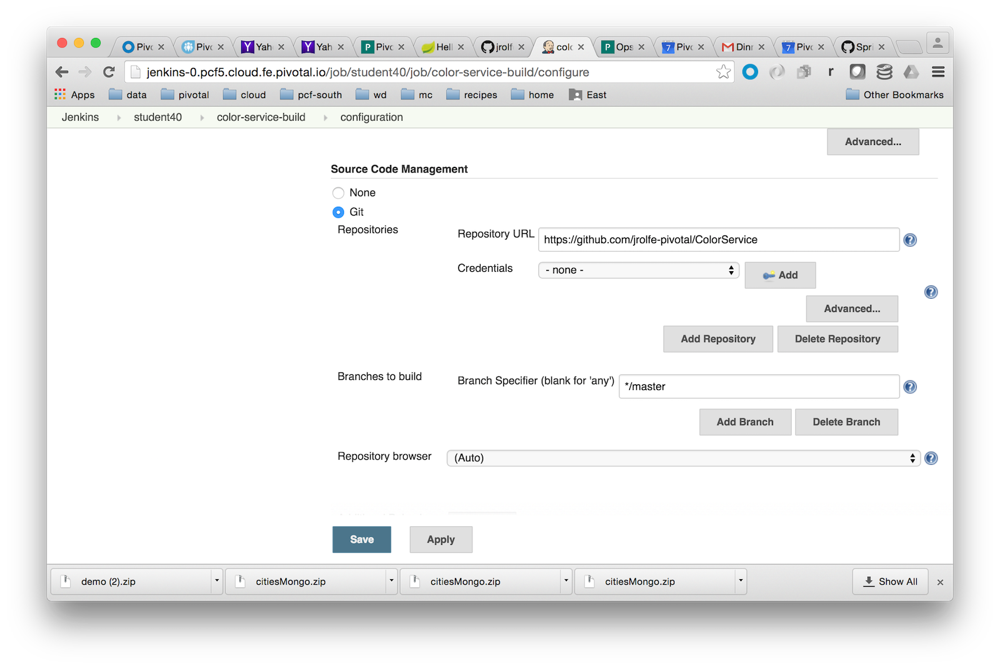
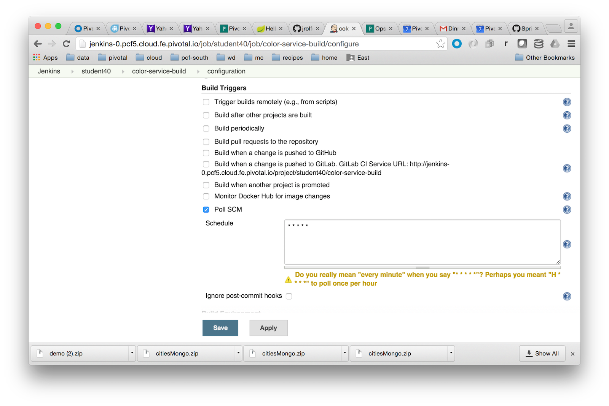
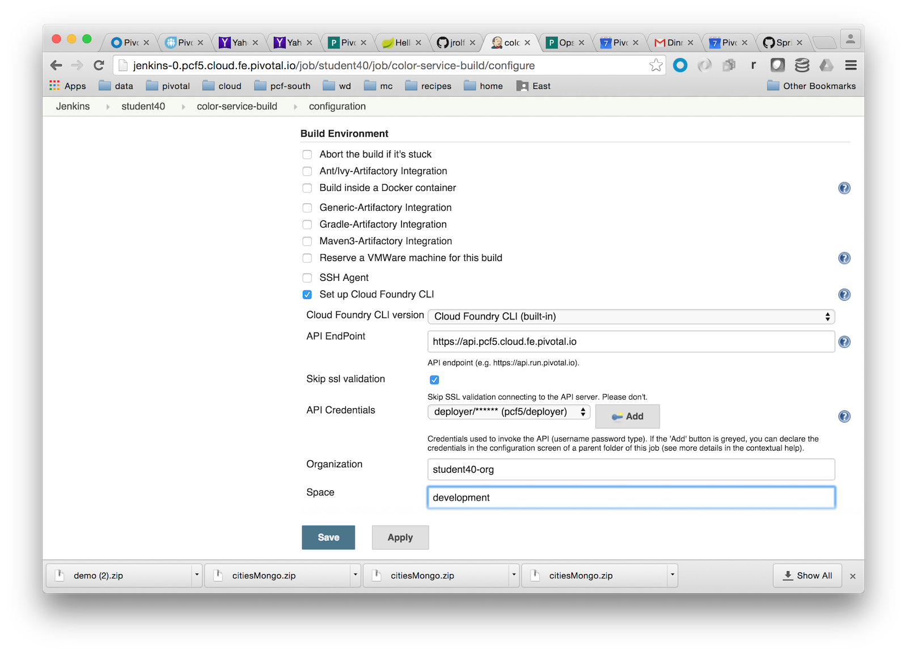

= Alternate Lab 7 - Strategies for Continuous Delivery - CI tools and Blue/Green Deployments

[abstract]
--
In this lab we will demonstrate a _very_ simple CI flow.  Normally, a full CI pipeline would consist of multiple steps, integrate with an artifact repository, create short-lived spaces within Cloud Foundry to run integration tests, etc.  Here, we will simply pull code from Github and push it to Cloud Foundry in a very simple blue-green manner using PCF route mapping.
--

== Configure your build system

. We will be using the same .NET code from the .NET portion of session 3.  Don't worry if you didn't do this lab, or if you don't know anything about .NET, the completed code is checked in to the https://github.com/jrolfe-pivotal/ColorService GitHub repository for use throughout the rest of this lab.

. If you don't already have a GitHub account, create one.  Once you are logged into GitHub, fork this repository to your account:  https://github.com/jrolfe-pivotal/ColorService.  (If you've never used GitHub before, grab an instructor, and they can show you how to perform a fork).  
+
Note: If you do not have a GitHub repository, and do not wish to create an account, you may use the root repository.  You will not, however, be able to commit changes, and will have to ask one of the instructors to make a commit for you when you're ready to test the CI flow.

. We'll be using a PCF managed deployment of Jenkins, which means that user identity is integrated between the two, and you can log into Jenkins using the same credentials you've been using all day with Cloud Foundry.  Open https://jenkins-0.pcf14.cloud.fe.pivotal.io (replacing pcf14 with the environment you've been using today if necessary) in a browser and login.

. You'll see a folder with your username on it, e.g. _student40_.  Click on this folder, and then select _New Item_ from the left hand side menu bar.  

. Create a new _Freestyle project_ called `color-service-build` and then click OK.

. Scroll down to the section labeled _Source Code Management_.  Choose `Git`, and enter the GitHub URL that points to the fork you created earlier.
+

. Scroll further down to the section labeled _Build Triggers_.  Normally, we would set up a GitHub hook, but for simplicity, we'll poll GitHub once a minute.  Choose the `Poll SCM` option, and enter `* * * * *` as the Schedule.
+

. Scroll further down to the section labeled _Build Environment_. Check the `Set up Cloud Foundry CLI` option.  Then enter the URL to the api of the environment you're using, e.g. `https://api.pcf14.cloud.fe.pivotal.io`.  Additionally, make sure `Skip ssl validation` is checked.   Chose the `deployer` user that has been pre-configured for you.  Enter the org for your student, e.g. `student40-org` and decide which space you would like the build to deploy into.
+

. Finally, in the section labeled _Build_, click on the `Add build step` dropdown and choose `Execute shell`.  In the command box that results, type the following, substituting in your environment number and replace `jrolfe` with your first initial and last name, to create routes that are unique throughout the class.
+
[source,bash]
----
cf push colorservice-v$BUILD_NUMBER -n colorservice-jrolfe-v$BUILD_NUMBER
cf map-route colorservice-v$BUILD_NUMBER pcf5.cloud.fe.pivotal.io -n colorservice-jrolfe
----
+
Now click `Save` to save your build configuration.  This will take you to the control screen for your color-service-build.  

. From the color-service-build screen, click on `Build Now` from the menu on the left.  This will trigger a build which you can monitor from the lower left hand side.  The build will either turn red (something failed) or green (success).  Once its finished, open the Apps Manager, and navigate to your application.

.  From the Apps Manager, click on the newly deployed colorservice-v1 to go into its control panel.  Then click the _Routes_ tab.  Notice that there are two routes defined for this application, `colorservice-yourname-v1` and what we'll call the logical, version independent route, `colorservice-yourname`.  Try clicking on both routes, and going to the api/colors endpoint, e.g. https://colorservice-yourname/api/colors

.  Scale this application up to 2 instances.

.  Go to your GitHub fork of the ColorService project, and navigate to `Controllers/ColorsController.cs`.  Click the GitHub pencil icon to switch to edit mode, and update "blue" to "green".  Then click the _Commit changes_ button.  

.  If you go back to your `color-service-build` you will see it kick off a new build within 1 minute.  Wait for this build to finish, and then switch back over to the Apps Manager.  Notice there is a new application, `colorservice-yourname-v2`.  Go into the application control panel for this new version and click on the _Routes_ tab.  Notice that, like before, there is a version specific route and a version independent route - the same route assigned to version 1 previously.

.  Click on the version independent route and go to the api/colors endpoint, e.g. https://colorservice-yourname/api/colors.  Refresh your browser page several times.  You should notice that you get a _blue_ response about two-thirds of the time.  This is because we have 2 instances of v1 and only 1 instance of v2.  
+
This basic process forms the basis of blue-green deployment strategies.  New versions of an application or microservice are deployed alongside the old version.  Traffic is slowly redirected to the new version by scaling the new up and scaling the old down.  Throughout this process, application operators can monitor the behavior of the application, and easily roll back just by unmapping the logical route from version new

== Clean up

.  Using the Apps Manager, delete all versions of the ColorService application that you deployed during this lab.
